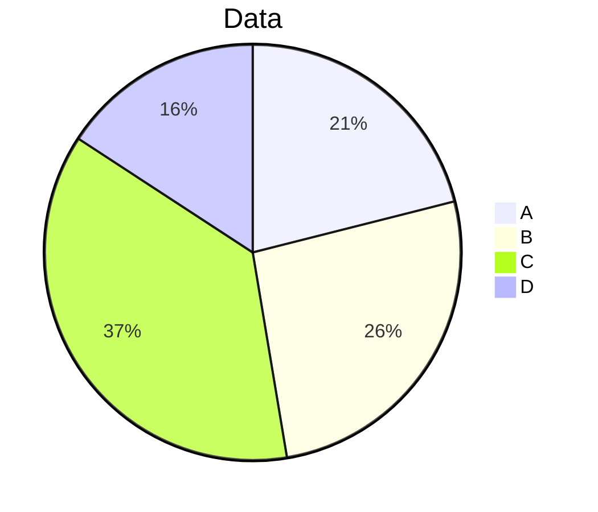

# Vocabularies

Quantitative Data : Data that represents amounts

Categorical Data : Data that represents groups (classifications)

Frequency : Actual count of data

Relative Frequency : Percentage of data

Association : Relativeness of two variables

# 1.1 Categorical Data Analysis

## Pie Chart

## Two Way Table

> Example Two Way Table
{: .prompt-info} 

|        | Company A | Company B | totals |
|--------|-----------|-----------|--------|
| Banana | 40        | 60        | 100    |
| Apple  | 40        | 60        | 100    |
| totals | 80        | 120       | 200    |

|            | category A | category B | Totals |
|------------|------------|------------|--------|
| category 1 | J          | J          | M      |
| category 2 | J          | J          | M      |
| Totals     | M          | M          | Total  |

$$
\begin{aligned}
&J \text{ - Joint Frequency} \\
&M \text{ - Marginal Frequency}\\
&{\small \frac{J}{M}} \text{ - Conditional Frequency}
\end{aligned}
$$

## Bar Graph

<canvas id="barGraphExample"></canvas>

### Side by Side Bar Graph

<canvas id="sideBySideBarGraphExample"></canvas>

### Segmented Bar Graph

# Quantative Data Analysis

## Dotplots

## Histogram

## Shape

### Unimodal

### Multimodal (2 or more peaks)

## Stemplots

